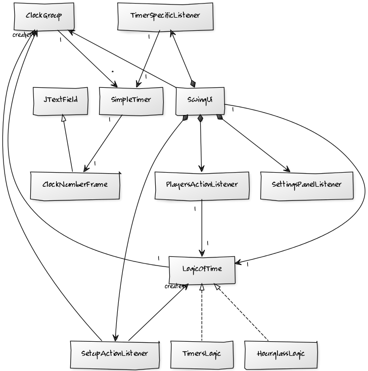

**Aihe** Lautapelikello. Toteutetaan mm. lautapeleissä käytettävä kello, jolla voidaan rajoittaa, sekä hallita pelaajien ajankäyttöä. Yksinkertaisimmillaan tämä olisi monen pelaajan shakkikello, mutta lisäominaisuuksia kelloon voidaan lisätä valtavasti. Tulossa olevia ominaisuuksia ovat vuoropohjainen ajanlisäys eli esim. +1 sekuntia pelkästään uuden oman vuoron saamisesta. Tämä estää ajan loppumisen, mutta pakottaa ajankäytön lopuksi minimiin.

**Käyttäjät** Esim. lautapelien pelaajat eli ihmiset, joilla on tarve kontrolloida ryhmän ajankäyttöä

**Käyttäjän toiminnot** 
* Valittavissa on pelaajien lukumäärä
* ajanottotyyli
* ajanmäärä

**Luokkakaavio**
SwingUi on käyttöliittymä ja on ensimmäinen käynnistyvä luokka. Käyttöliittymän tärkein paneeli käyttää cardlayouttia ja näkyvä card näyttää aina joko asetukset uuteen luotavaan kelloon tai käytössä oleva kellon.

Itse logiikka toteuttaa LogicOfTime rajapinnan ja tarvitsee ainoastaan tiedon Clockgroupista, joka sisältää listan SimpleTimereita. Logiikka antaa SimpleTimereille käskyjä loopin kuluessa käyttäjän painallukset huomioiden.

Yksittäinen SimpleTimer on yksinkertainen luokka joka tietää oman minuutti ja sekuntti määränsä ja sillä on useita metodeja näiden muokkaamiseksi. SimpleTimeriin kuuluu luokka ClockNumberFrame, joka on laajennus JTextFieldistä, joten kaikilla SimpleTimereilla on oma JTextField, jota ne osaavat päivittää.

Sekvenssikaavio käynnistyksestä logiikanluontiin ja sen ui:n luontiin.

Sekvenssikaavio logiikan kierroksesta.

